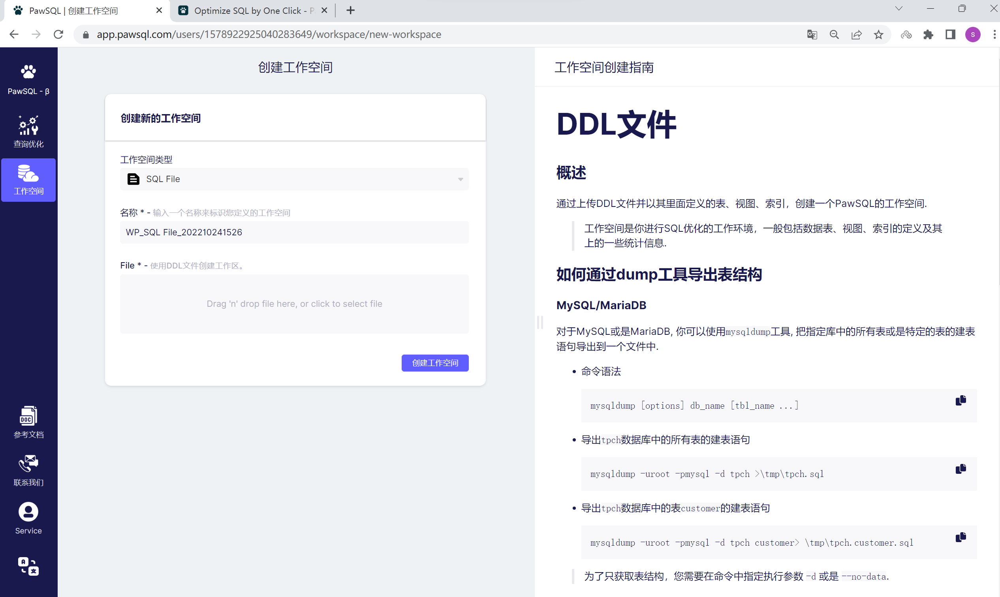
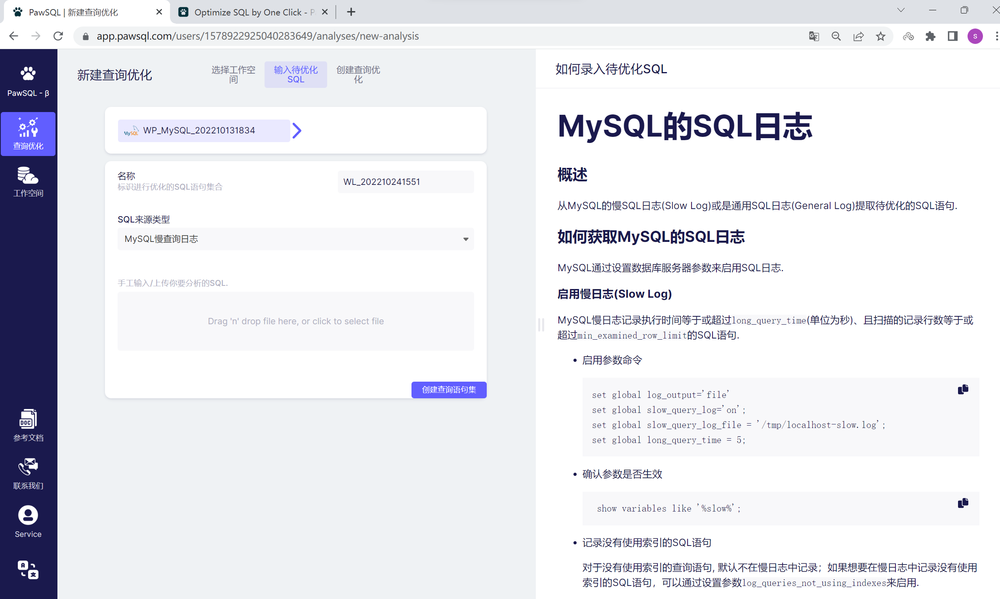
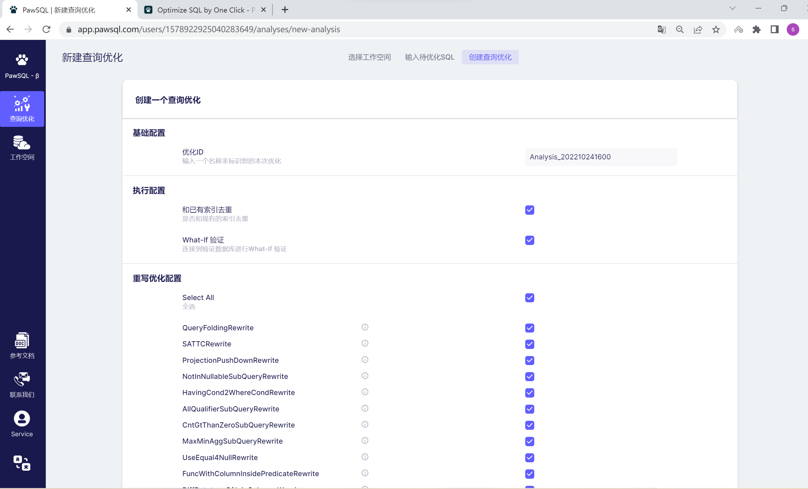
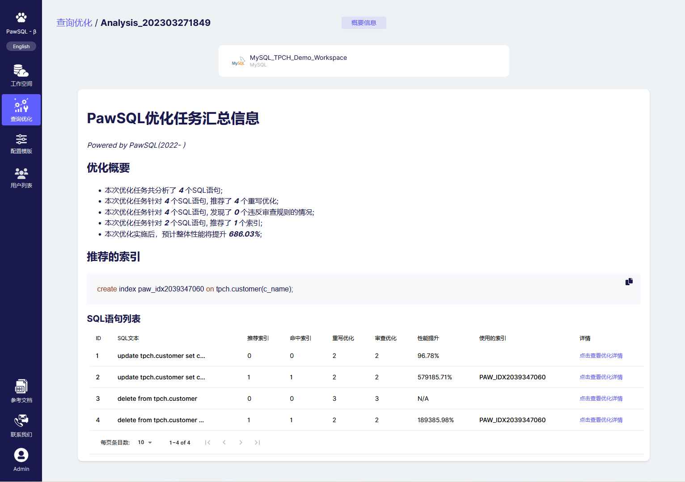
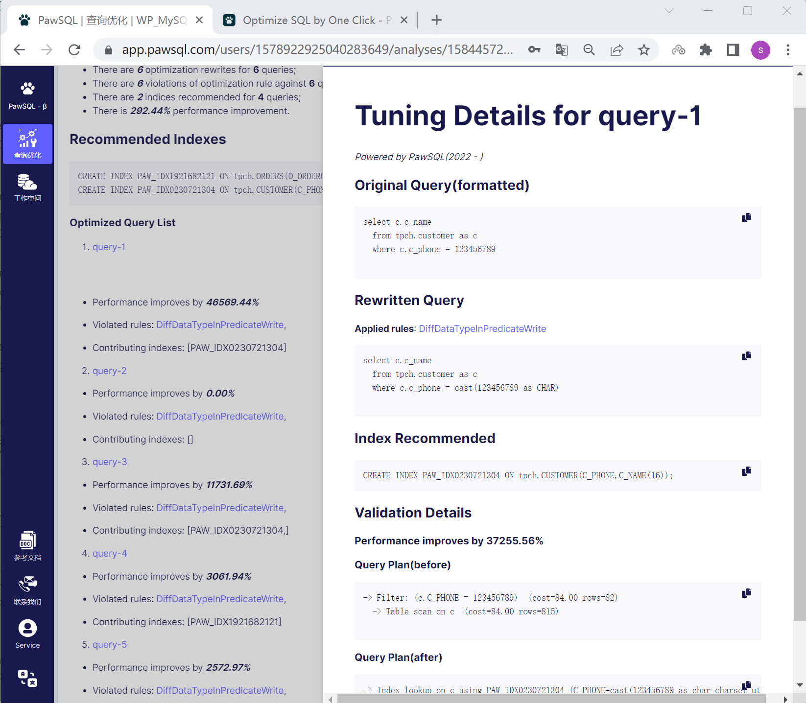

  <strong>
    A 
    <a href="https://pawsql.github.io/">PawSQL site</a> 
    made by 
    <a href="https://squidfunk.github.io//">Material MkDocs</a>
  </strong>

# PawSQL Cloud User Guide (上手指南)

## 概述(Summary)
PawSQL Cloud是PawSQL Advisor的Web版本，它整合了业界关于关系数据库查询优化最佳实践，通过查询重写优化、智能索引推荐，帮助应用开发人员及数据库管理人员一站式解决SQL性能问题。
相比较PawSQL Advisor/Paw Index Advisor等基于IntelliJ的插件，PawSQL Cloud免安装，不依赖其他工具，不仅适合应用开发人员，也适合数据库管理人员等非开发人员使用；PawSQL Cloud同时能够记录您的优化历史，便于日后查看和跟踪。

PawSQL Cloud is a web-based version of PawSQL Advisor that integrates the best practices of relational database query optimization. Through query rewrite optimization and intelligent index recommendation, it helps application developers and database administrators solve SQL performance problems in a one-stop solution.

Compared to plugins based on IntelliJ such as PawSQL Advisor/Paw Index Advisor, PawSQL Cloud is easy to use without installation or dependence on other tools, and is suitable for both application developers and non-developers such as database administrators. PawSQL Cloud also records your optimization history for future review and tracking.

### 核心功能(Features)

- 基于规则的SQL审查，包括正确性审查和性能优化审查规则。
- 丰富的基于规则的重写优化，推荐语义等价，但执行效率更高的SQL。
- 智能索引推荐，满足各种SQL语法组合的场景下，推荐最优的索引组合。
- 优化验证，确保基于SQL重写和索引推荐的新方案有着更好的性能。

- Rules-based SQL auditing, targeting correctness auditing and performance optimization.
- Rewrite optimization, recommended semantically equivalent, but more efficient SQL.
- Intelligent index recommendation, based on input SQL syntax, database objects and statistics information.
- What-if analysis to ensure gaining better performance after SQL rewriting and indexing recommendations.

## 三步完成您的SQL优化(Three Steps to set up an optimization)

- 选择/创建工作空间
- 输入待优化SQL
- 查询优化配置

- Create a workspace
- Input the SQLs(a workload) to be optimized
- Setup a optimization

### 1. 选择/创建工作空间(Create a workspace)
<b>工作空间</b>是你进行<b>SQL优化</b>的工作环境，一般包括数据表、视图、索引的定义及其上的一些统计信息. PawSQL Cloud支持以下方式创建您的工作空间。

- 通过数据库连接信息创建工作空间
    - 支持MySQL/PostgreSQL/Opengauss/MariaDB等数据库
- 通过DDL文件创建工作空间
- 通过手工输入DDL语句创建工作空间

PawSQL Cloud supports creating a workspace in the following ways:

1. By database connection information: supports databases such as MySQL, PostgreSQL, Opengauss, and MariaDB.
2. By uploading a DDL file
3. By manually inputting DDL text.

  

__提示__: 对于每一种工作空间创建方式，PawSQL提供了在线指南帮您创建您的工作空间。

__Hint__: For each method of creating a workspace, PawSQL provides online guides to help you set up your workspace on the right half.

### 2. 输入待优化SQL(2. Input the SQLs/Create a workload)

待优化SQL是您进行查询优化的对象，它的来源可以是

- 数据库SQL日志

    - 支持MySQL慢日志/通用日志，PostgreSQL的SQL日志，opengauss的SQL日志

- 待优化SQL组成的文本文件；以`;`分割

- 文本框手工输入的SQL语句；以`;`分割

The source of the SQL to be optimized can be:

1. Database SQL log (supporting MySQL slow log/general log, PostgreSQL SQL log, opengauss SQL log)
2. A text file composed of SQL statements separated by `;`
3. SQL statements manually inputted into a text box separated by `;` Note: You can also see that PawSQL provides an online guide to help you obtain the SQL to be optimized.

  
  __提示__: 同样的，您可以看到PawSQL提供了在线指南帮您获取待优化的SQL。

### 3. 查询优化配置(Setup a optimization)

<b>查询优化</b>表示在您的<b>工作空间</b>内对一组SQL查询进行的性能优化诊断，一般包括SQL审查、重写优化、索引推荐等.
您可以对您的查询优化进行配置，控制查询优化的执行过程和结果

- 基础配置

    - 优化ID: 标识您本次优化的ID

- 执行配置

    - 和现有索引去重: 是否和现有索引去重
    - 是否进行what-if验证: 是否连接到验证服务器，对查询优化的结果进行性能验证。

- 规则配置

    - 是否启用该优化规则

You can configure your query optimization to control the execution process and results of your query optimization.

- Basic Configuration:
  - Optimization ID: Identifies your optimization ID for this optimization session.

- Execution Configuration:
  - Dedup with Existing Indexes: Whether to deduplicate with existing indexes.
  - Perform What-if Verification: Whether to connect to a verification server to validate the performance of the optimization results.

- Rule Configuration:
  - Enable the optimization rule.

## 执行结果展示(Explain the output)
### 汇总结果展示(Optimization Summary)

内容包括

- 执行的SQL数目
- 重写优化的数据
- SQL审查的数目
- 推荐的索引
- 单个SQL优化概况

The summary results display includes:

- Number of executed SQLs

- Number of rewrote optimizations

- Number of SQL auditing rule violations

- Recommended indexes

- Overview of individual SQL optimization

### 单SQL优化详情

- 原SQL
- 重写后的SQL（若有）
- 推荐的索引（若有）
- 验证详情（若设置what-if验证）
    - 性能提升百分比
    - 优化前的执行计划
    - 优化后的执行计划

For each SQL query, PawSQL will provide optimization details to show you ***WHAT\*** and ***HOW\*** the query is tuned, ***HOW MUCH\*** does its performance improve and etc. There are ***FIVE\*** sections in this query level tuning details, as follows.

- Original SQL: The original SQL statement you are optimizing.
- Rewritten SQL (if any): If the SQL statement has been rewritten, this shows the rewritten SQL statement.

- Recommended Index (if any): If there is a suggested index, the details of the index are displayed here.

- Validation Details (if what-if validation is set): If what-if validation is performed, this shows the details of the validation, including:

  - Performance improvement percentage: The percentage difference in performance between the optimized and unoptimized SQL statements.

  - Execution plan before optimization: The execution plan of the SQL statement before optimization.

  - Execution plan after optimization: The execution plan of the SQL statement after optimization.

## 结束语(Contact us)
PawSQL Cloud的网址为 https://app.pawsql.com, 欢迎大家试用。如需私域部署PawSQL Cloud，或是希望集成PawSQL的优化引擎到自己的数据库监控平台/SQL审核平台，请联系service@pawsql.com或是在微信搜索PawSQL关注公众号。

Website: https://www.pawsql.com

Twitter:https://twitter.com/pawsql

Email: service@pawsql.com

WeChat: 